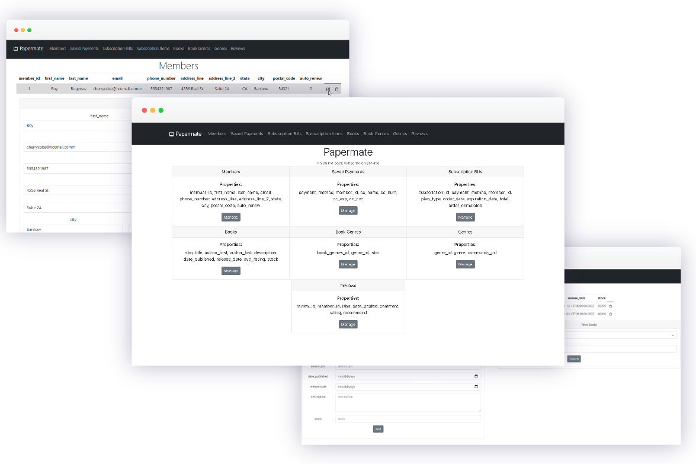
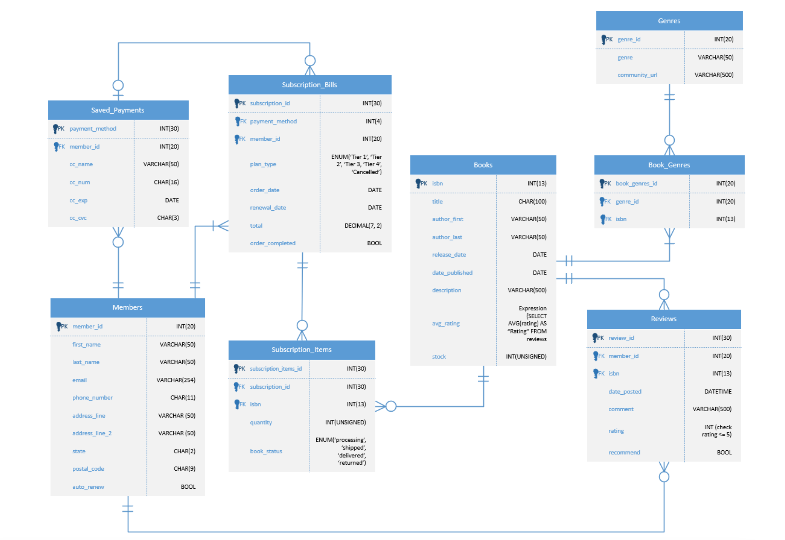

# Papermate

   

A web interface made with React for managing a MariaDB (MySQL) relational database for a fictional book subscription service. Enables administrators to perform CRUD operations on tables for users, saved payments, billing statements, shopping carts, books, genres, and reviews.

## Preview 

## Entity Relationship Diagram

